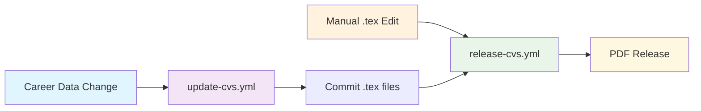
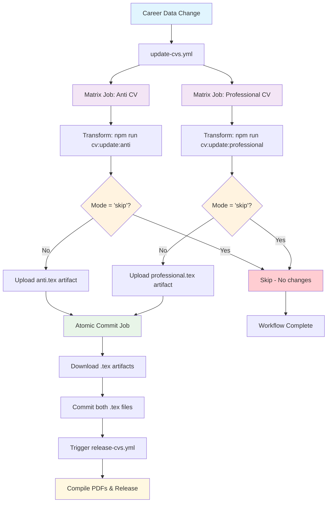

# CV Generation Architecture

AI-powered CV generation using Claude to transform career data into LuaLaTeX documents.

## Core Files

- **run-cv-update.ts** - Main orchestrator
- **transform-incremental.ts** - Processes git diff changes  
- **transform-full-rebuild.ts** - Complete regeneration
- **transform-utils.ts** - Shared processing logic
- **claude-api.ts** - API calls and LuaLaTeX extraction
- **config.ts** - Paths, types, environment variables

## Workflow Architecture

### Two-Workflow System



**Workflow 1: `update-cvs.yml`** - AI transformation and LuaLaTeX commits
- Parallel processing (matrix: anti + professional)
- Git commits to trigger release workflow

**Workflow 2: `release-cvs.yml`** - PDF compilation and GitHub releases  
- Triggered by .tex file changes
- Creates downloadable PDF releases

### Processing Flow



**Incremental**: Only processes git changes since last commit  
**Full rebuild**: Regenerates entire CV from career data

## Local Testing

```bash
# Basic test with mocks
npm test

# Test specific CV type
CV_TYPES=anti npm test

# Test with git history
GIT_DIFF_RANGE=5 npm test

# Dry run (no file changes)
DRY_RUN=true npm test
```

## Environment Variables

**Required for API**: `ANTHROPIC_API_KEY`

**Optional**:
- `CV_TYPES=professional,anti` (default: both)
- `SKIP_API=true` (uses mocks)
- `DRY_RUN=true` (no file writes)
- `GIT_DIFF_RANGE=1` (commits to diff)

## CV Types

- **professional**: Traditional business format
- **anti**: Humorous format highlighting failures

## Workflow Triggers

### update-cvs.yml
- Push/PR to any branch with changes in:
  - `.github/workflows/update-cvs.yml`
  - `_data/**`
  - `curriculum_vitae/**`
- Manual dispatch with rebuild mode selection

### release-cvs.yml  
- Push to main branch with changes in:
  - `.github/workflows/release-cvs.yml`
  - `curriculum_vitae/markus-schulte-dev-*.tex`
- Manual dispatch for forced releases

## Key Features

**Parallel Processing**: Both CV types processed simultaneously in matrix jobs

**Smart Skip Logic**: Workflow detects when no changes exist and skips unnecessary steps
- Transform scripts output `mode: 'skip'` when no changes detected
- Artifact upload and commit jobs conditionally execute based on skip status
- Prevents empty commits and unnecessary PDF generation

**Atomic Commits**: All .tex changes committed together via `stefanzweifel/git-auto-commit-action`

**Artifact-Based Transfer**: Updated .tex files flow between jobs via GitHub Actions artifacts
- Matrix jobs upload individual .tex files as artifacts
- Commit job downloads both artifacts before committing
- Ensures proper file transfer across isolated job runners

**Manual Flexibility**: Edit .tex files directly → automatic PDF release

**Separation of Concerns**: AI transformation vs PDF compilation in separate workflows

## File Structure

```
curriculum_vitae/
├── scripts/
│   ├── tmp/
│   │   ├── response_*.json    # API responses
│   │   ├── temp_*.tex         # Processed LuaLaTeX
│   │   └── career_changes.diff # Git diff
│   └── *.ts                   # Node.js scripts
├── markus-schulte-dev-anti-cv.tex
└── markus-schulte-dev-professional-cv.tex

.github/workflows/
├── update-cvs.yml             # AI transformation workflow
└── release-cvs.yml            # PDF compilation workflow
```

Mock mode automatically activates without API key or with `SKIP_API=true`.
